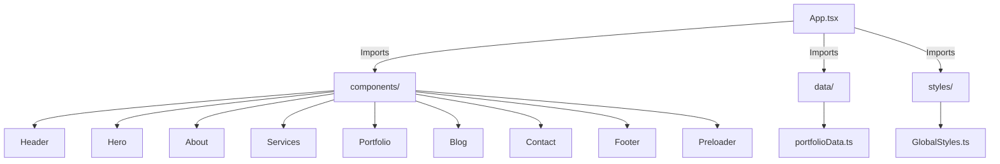
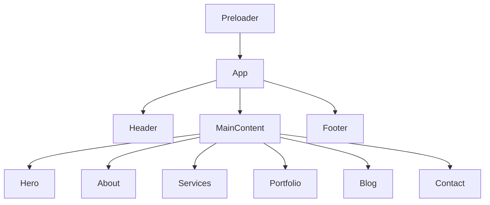

# DevFolio Portfolio


---

## 🚀 Project Overview

DevFolio Portfolio is a modern, high-performance personal portfolio template built with the latest web technologies: **React 19, TypeScript, Styled Components, Framer Motion, Bootstrap 5, and Vite**. It is designed to showcase your work, skills, and projects with beautiful animations, responsive layouts, and a professional touch.

---

## 🏗️ Main Components

- **Header**: Sticky navigation bar with active section tracking
- **Hero**: Animated hero section with call-to-action
- **About**: Personal info, profile image, and animated skills progress bars
- **Services**: Service cards with icons
- **Portfolio**: Project gallery with dynamic filtering
- **Blog**: Latest blog posts with images
- **Contact**: Contact form with validation
- **Footer**: Social links and contact info
- **Preloader**: Animated loading screen

---

## 🛠️ Tech Stack

| Technology         | Purpose                        |
|-------------------|--------------------------------|
| React 19          | UI Components                  |
| TypeScript 5.8    | Type Safety                    |
| Styled Components | CSS-in-JS Styling              |
| Framer Motion     | Animations & Transitions       |
| Bootstrap 5.3     | Responsive Design              |
| Vite 7.0          | Fast Development & Bundling    |
| ESLint            | Code Quality                   |
| TypeScript ESLint | TypeScript Linting             |
| Lazy Loading      | Images & Performance           |
| Code Splitting    | Performance Optimization       |
| SEO Meta Tags     | Search Engine Optimization     |
| Accessibility     | WCAG 2.1 AA Compliance         |
| Error Handling    | Robust Forms & UI              |
| Responsive Design | Mobile-first                   |

---

## ✨ Key Features

- 🎨 **Modern, elegant, and clean design**
- 📱 **Fully responsive** for all devices
- ⚡ **Smooth, professional animations** (Framer Motion)
- 🖼️ **Lazy loading** for images & performance optimization
- ♿ **Accessibility** (WCAG 2.1 AA compliant)
- 🔍 **SEO optimized** with structured data
- 🚀 **Fast loading** and Core Web Vitals ready
- 🧩 **Separation of data and UI** for easy customization
- 🌙 **Dark mode support** (coming soon)
- 🧹 **Clean, scalable codebase**

---

## 📦 Project Structure



<details>
<summary>Directory Overview</summary>

```
src/
  App.tsx            # Main app composition
  main.tsx           # Entry point
  components/        # All UI sections
  data/              # Portfolio/services/skills data
  styles/            # Global styles (Styled Components)
  types/             # TypeScript interfaces
  assets/            # Static images/logos
  utils/, hooks/     # Utilities & custom hooks (extensible)
  pages/             # For future routing/pages
public/
  imgs/              # Project & background images
```
</details>

---

## 🖥️ UI Flow Diagram



---

## 🚦 Getting Started

1. **Install dependencies:**
   ```bash
   npm install
   ```
2. **Run the development server:**
   ```bash
   npm run dev
   ```
3. **Build for production:**
   ```bash
   npm run build
   ```

---

## 📝 Notes

- All content (projects, skills, services, etc.) is easily editable in `src/data/portfolioData.ts`.
- The codebase is modular and ready for future features (Dark Mode, PWA, Analytics, etc.).
- Works seamlessly on all modern browsers.

---

## 📄 License

MIT License

---

## 👨‍💻 Author

Developed by Khaled Tareq.

---
